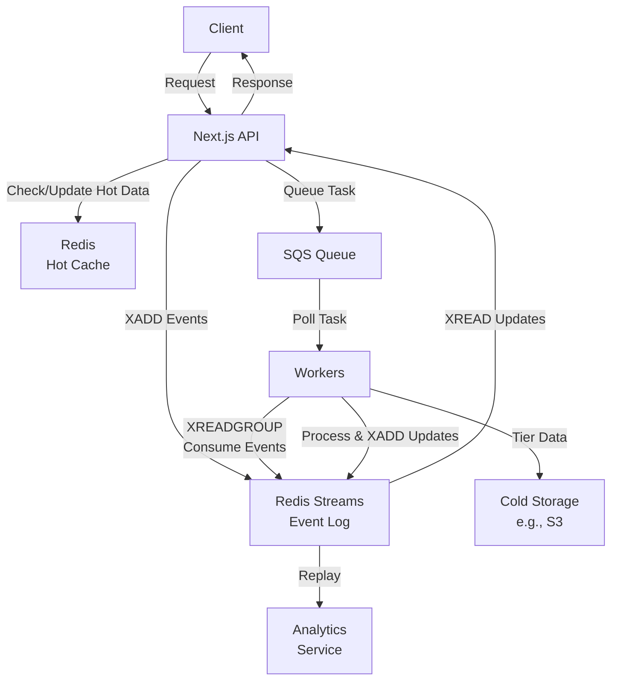

# Data Flow in Microservices Workers Architecture with Next.js API, Redis Streams, SQS, Hot and Cold Data

## Overview
In a microservices workers architecture, components like Next.js API, Redis Streams, SQS, and hot/cold data management enable scalable, asynchronous processing. Workers handle background tasks, while data tiers optimize access and costs.

## Architecture Components
- **Next.js API**: Acts as an API gateway, handling client requests, caching, and routing to services.
- **Redis Streams**: Persistent, ordered data structures for event streaming, real-time analytics, and inter-service communication.
- **SQS**: Managed queue for decoupling producers (APIs/services) from consumers (workers), ensuring reliable task distribution.
- **Hot Data**: Frequently accessed data stored in fast storage (e.g., Redis) for low-latency reads/writes.
- **Cold Data**: Rarely accessed data archived in cheap storage (e.g., S3) for cost efficiency.
- **Workers**: Microservices that process queued tasks asynchronously, updating data tiers.

## Data Flow Example with Redis Streams
1. **Client Request**: User sends request to Next.js API (e.g., submit order).
2. **API Processing**: API checks hot data in Redis for quick responses. Appends event to Redis Streams (XADD) for persistent logging (e.g., 'order_created').
3. **Queue Task**: API sends background task to SQS queue for workers.
4. **Worker Consumption**: Worker polls SQS, processes task, consumes related events from Streams (XREADGROUP) for context, appends results (e.g., 'payment_processed').
5. **Data Tiering**: Worker moves processed data to hot (Redis) for active use; archives old data to cold storage. Updates are logged in Streams for audit.
6. **Response Flow**: API reads latest updates from Streams (XREAD), caches in Redis, and responds to client. Workers acknowledge processed messages (XACK). Streams enable replay for analytics or retries.

## Benefits
- **Scalability**: SQS and workers handle load spikes; Redis Streams manage high-throughput events.
- **Performance**: Hot data in Redis ensures fast access; cold data reduces storage costs.
- **Reliability**: Persistence in Redis Streams/SQS prevents data loss; asynchronous workers decouple failures.
- **Microservices Fit**: Loose coupling via queues/streams enables independent scaling.

## Architecture Diagram with Redis Streams Integration

For code examples or deeper dives, expand this file with specific implementations.