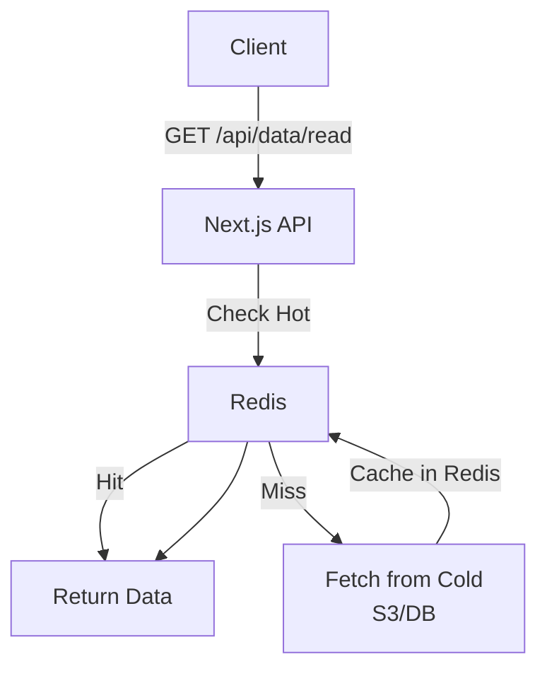
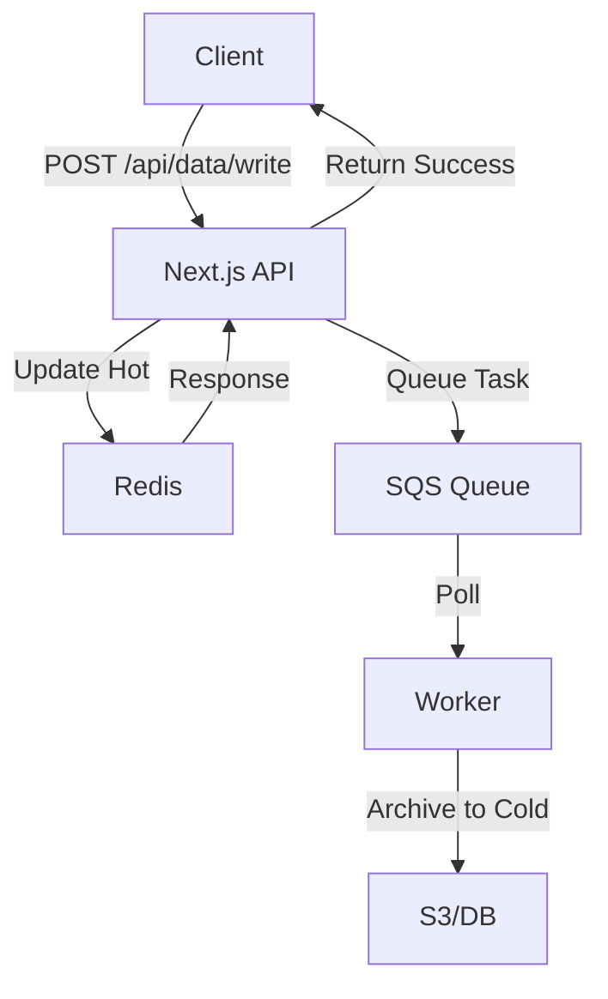
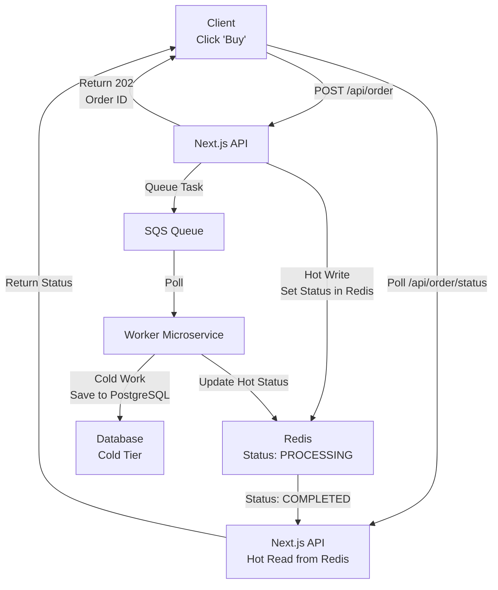
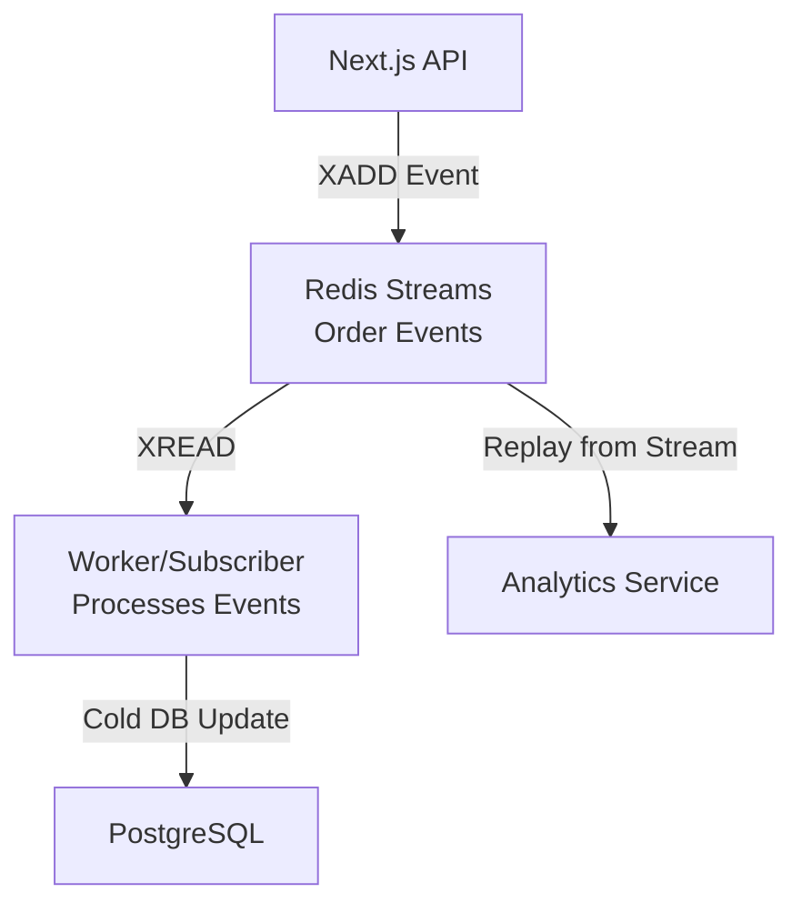
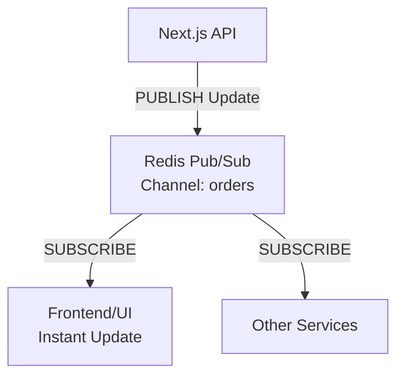
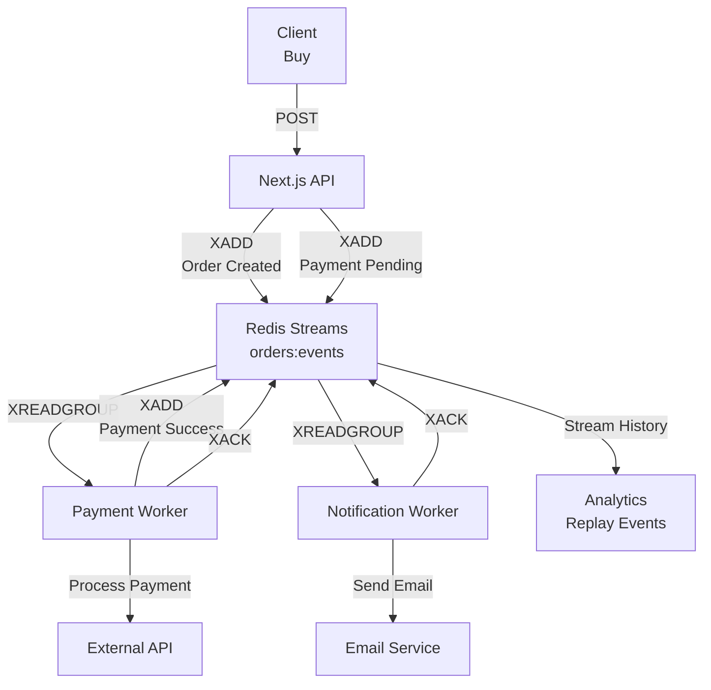

# Step-by-Step Hot and Cold Data Flow with Read/Write Requests

This guide explains the data flow for read and write requests in a microservices architecture, managing hot data (frequently accessed, fast storage like Redis) and cold data (rarely accessed, cheap storage like S3). Flows start from API calls and end with responses or updates.

## Prerequisites

- Next.js API routes.
- Redis for hot data.
- S3 or similar for cold data.
- SQS for queuing tasks.
- AWS SDK for S3/SQS.

## Read Request Flow (Fetching Data)



### Step 1: Client Sends Read Request

Client requests data via GET.

**Example**:

```javascript
const data = await fetch("/api/data/read?key=user123");
```

### Step 2: API Checks Hot Data (Redis)

Query Redis first for fast access.

**API Route (app/api/data/read/route.js)**:

```javascript
import Redis from "ioredis";
const redis = new Redis(process.env.REDIS_URL);

export async function GET(req) {
  const key = new URL(req.url).searchParams.get("key");
  const cacheKey = `hot:${key}`;

  try {
    const hotData = await redis.get(cacheKey);
    if (hotData) return new Response(hotData, { status: 200 });
  } catch (error) {
    console.error("Redis error:", error);
  }
  // Proceed to Step 3
}
```

### Step 3: Fetch from Cold Data (S3/DB)

If not in hot, fetch from cold storage.

**Updated API Route**:

```javascript
import { S3Client, GetObjectCommand } from "@aws-sdk/client-s3";
const s3 = new S3Client({ region: "us-east-1" });

if (!hotData) {
  try {
    const command = new GetObjectCommand({
      Bucket: "cold-data-bucket",
      Key: `${key}.json`,
    });
    const response = await s3.send(command);
    const coldData = await response.Body.transformToString();

    // Move to hot (cache)
    await redis.set(cacheKey, coldData, "EX", 3600); // 1 hour TTL
    return new Response(coldData, { status: 200 });
  } catch (error) {
    return new Response("Data not found", { status: 404 });
  }
}
```

### Step 4: Return Response

Data returned to client.

## Write Request Flow (Updating Data)



### Step 1: Client Sends Write Request

Client submits data via POST/PUT.

**Example**:

```javascript
await fetch("/api/data/write", {
  method: "POST",
  body: JSON.stringify({ key: "user123", data: { name: "John" } }),
});
```

### Step 2: API Updates Hot Data (Redis)

Write to Redis immediately for fast access.

**API Route (app/api/data/write/route.js)**:

```javascript
export async function POST(req) {
  const { key, data } = await req.json();
  const cacheKey = `hot:${key}`;

  try {
    await redis.set(cacheKey, JSON.stringify(data), "EX", 3600);
  } catch (error) {
    return new Response("Write failed", { status: 500 });
  }
  // Proceed to Step 3
}
```

### Step 3: Queue for Cold Storage Update

Send task to SQS for asynchronous archival.

**Updated API Route**:

```javascript
import { SQSClient, SendMessageCommand } from "@aws-sdk/client-sqs";
const sqs = new SQSClient({ region: "us-east-1" });

const command = new SendMessageCommand({
  QueueUrl: process.env.SQS_QUEUE_URL,
  MessageBody: JSON.stringify({ action: "archive", key, data }),
});
await sqs.send(command);

return new Response("Data written", { status: 200 });
```

### Step 4: Workers Process Archival

Workers poll SQS and update cold storage.

**Worker Code (worker.js)**:

```javascript
while (true) {
  const { Messages } = await sqs.send(
    new ReceiveMessageCommand({ QueueUrl: queueUrl }),
  );
  if (Messages) {
    const { action, key, data } = JSON.parse(Messages[0].Body);
    if (action === "archive") {
      // Write to S3
      await s3.send(
        new PutObjectCommand({
          Bucket: "cold-data-bucket",
          Key: `${key}.json`,
          Body: JSON.stringify(data),
        }),
      );
    }
    // Delete message
    await sqs.send(
      new DeleteMessageCommand({
        QueueUrl: queueUrl,
        ReceiptHandle: Messages[0].ReceiptHandle,
      }),
    );
  }
  await new Promise((resolve) => setTimeout(resolve, 1000));
}
```

### Step 5: End Flow

- Hot data updated instantly.
- Cold data updated asynchronously.
- Response sent immediately for writes.

## Real-World Example: Order Processing Flow

This example demonstrates the hot/cold flow in an e-commerce order system, using Next.js API for instant writes/reads, Redis for hot status, SQS for queuing, and a worker for cold database updates.



### Step 1: The API Entry (The "Hot" Write)

When the user clicks "Buy," the Next.js API route immediately records the intent in Redis.

**Code Example (app/api/order/route.ts)**:

```typescript
import { SQSClient, SendMessageCommand } from "@aws-sdk/client-sqs";
import Redis from "ioredis";
import { NextResponse } from "next/server";

const redis = new Redis(process.env.REDIS_URL!);
const sqs = new SQSClient({ region: "us-east-1" });

export async function POST(req: Request) {
  const { userId, productId } = await req.json();
  const orderId = `ord_${crypto.randomUUID()}`;

  // HOT WRITE: Set initial state in Redis
  await redis.set(
    `status:${orderId}`,
    JSON.stringify({
      state: "PROCESSING",
      timestamp: Date.now(),
    }),
    "EX",
    300,
  );

  // OFFLOAD: Send to SQS
  await sqs.send(
    new SendMessageCommand({
      QueueUrl: process.env.SQS_QUEUE_URL,
      MessageBody: JSON.stringify({ orderId, userId, productId }),
    }),
  );

  // INSTANT RESPONSE: Return 202
  return NextResponse.json({ orderId }, { status: 202 });
}
```

### Step 2: The UI Polling (The "Hot" Read)

Frontend polls for status from Redis.

**Code Example (app/api/order/status/route.ts)**:

```typescript
export async function GET(req: Request) {
  const { searchParams } = new URL(req.url);
  const orderId = searchParams.get("orderId");

  const status = await redis.get(`status:${orderId}`);
  return NextResponse.json(
    status ? JSON.parse(status) : { state: "NOT_FOUND" },
  );
}
```

### Step 3: Background Worker (Bridging Hot & Cold)

Worker processes SQS and updates cold DB, then hot Redis.

**Code Example (worker-service.ts)**:

```typescript
async function handleMessage(message) {
  const { orderId, userId, productId } = JSON.parse(message.Body);

  // COLD WORK: Save to database
  await updateMainDatabase(orderId, { status: "COMPLETED" });

  // HOT UPDATE: Update Redis
  await redis.set(
    `status:${orderId}`,
    JSON.stringify({
      state: "COMPLETED",
      timestamp: Date.now(),
    }),
    "EX",
    300,
  );
}
```

### Step 4: The End State

User sees instant PROCESSING, then COMPLETED after worker finishes.

**Summary**: Next.js API sets Redis → SQS → 202. Frontend polls Redis. Worker: SQS → Cold DB → Update Redis. User gets ~50ms response despite seconds-long background work.

## Integrating Redis Streams for Event Logging

For persistent event history and replay, use Redis Streams instead of simple key-value for status updates.



**Code Example (API with Streams)**:

```typescript
// In app/api/order/route.ts, after Redis set
await redis.xadd(
  "orders:events",
  "*",
  "event",
  "order_created",
  "orderId",
  orderId,
  "state",
  "PROCESSING",
);

// Worker reads from stream
const events = await redis.xread("STREAMS", "orders:events", "0");
for (const event of events[0][1]) {
  // Process event
}
```

## Integrating Redis Pub/Sub for Real-Time Notifications

For instant, non-persistent broadcasts, use Pub/Sub to notify subscribers (e.g., UI or other services) without polling.



**Code Example (API with Pub/Sub)**:

```typescript
// In app/api/order/route.ts, after Redis set
await redis.publish(
  "orders:updates",
  JSON.stringify({ orderId, state: "PROCESSING" }),
);

// Frontend subscribes (in client or server)
redis.subscribe("orders:updates", (message) => {
  const update = JSON.parse(message);
  // Update UI instantly
});
```

**When to Use**: Streams for durable logs/replay; Pub/Sub for ephemeral broadcasts. Both can complement key-value caching for richer flows.

## Complete Redis Stream Flow Example: Event-Driven Order Processing

This example uses Redis Streams for persistent event logging in the order flow, allowing replay and multiple consumers.



### Step 1: API Appends Events to Stream

**Code (app/api/order/route.ts)**:

```typescript
export async function POST(req: Request) {
  const { userId, productId } = await req.json();
  const orderId = `ord_${crypto.randomUUID()}`;

  // Append to stream
  await redis.xadd(
    "orders:events",
    "*",
    "event",
    "order_created",
    "orderId",
    orderId,
    "userId",
    userId,
    "productId",
    productId,
    "timestamp",
    Date.now(),
  );

  await redis.xadd(
    "orders:events",
    "*",
    "event",
    "payment_pending",
    "orderId",
    orderId,
  );

  return NextResponse.json({ orderId }, { status: 202 });
}
```

### Step 2: Workers Consume from Stream with Consumer Groups

**Payment Worker (worker-payment.ts)**:

```typescript
// Create consumer group
await redis.xgroup("CREATE", "orders:events", "payment-group", "0", "MKSTREAM");

// Read pending messages
const messages = await redis.xreadgroup(
  "GROUP",
  "payment-group",
  "worker1",
  "COUNT",
  "1",
  "STREAMS",
  "orders:events",
  ">",
);

for (const message of messages[0][1]) {
  const event = message[1];
  if (event.event === "payment_pending") {
    // Process payment
    await processPayment(event.orderId);

    // Append success event
    await redis.xadd(
      "orders:events",
      "*",
      "event",
      "payment_success",
      "orderId",
      event.orderId,
    );

    // Acknowledge
    await redis.xack("orders:events", "payment-group", message[0]);
  }
}
```

### Step 3: Notification Worker

Similar to payment worker, consumes 'payment_success' events to send notifications.

### Step 4: Analytics Replay

Replay from start: `XREAD STREAMS orders:events 0`

**Benefits**: Persistent events, load balancing via groups, replay for debugging/analytics, decoupled consumers.

## Key Considerations

- **TTL**: Set expiration on hot data to manage memory.
- **Consistency**: For critical data, ensure cold updates before responding (synchronous).
- **Errors**: Handle Redis/S3 failures with retries or fallbacks.
- **Monitoring**: Track metrics with CloudWatch.

Install dependencies: `npm install ioredis @aws-sdk/client-s3 @aws-sdk/client-sqs`.
