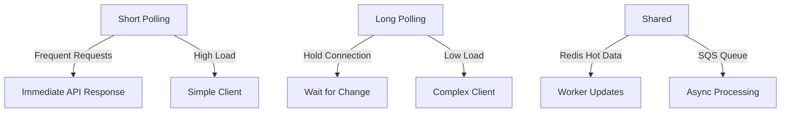

# Step-by-Step: Short Polling vs Long Polling in Current Architecture

This guide explains how short polling (regular polling) and long polling work step-by-step in the microservices architecture with Next.js API, Redis, SQS, and hot/cold data. Both handle async POST responses, but differ in efficiency and implementation.

## Common Setup
- Client sends POST to `/api/order` → API returns 202 + orderId immediately.
- Workers process via SQS, update Redis with status.
- Client checks status via GET to `/api/order/status`.

## Short Polling (Regular Polling) Flow
Client polls at fixed intervals (e.g., every 2 seconds) regardless of updates.

### Step 1: Client Initiates Polling
After POST, client starts interval polling.

**Client Code**:
```javascript
setInterval(async () => {
  const res = await fetch(`/api/order/status?orderId=${orderId}`);
  const status = await res.json();
  if (status.state === 'COMPLETED') {
    clearInterval(interval); // Stop
  }
}, 2000);
```

### Step 2: API Responds Immediately
Status API checks Redis and returns current status instantly.

**API Code**:
```typescript
export async function GET(req: Request) {
  const orderId = req.searchParams.get('orderId');
  const status = await redis.get(`status:${orderId}`);
  return NextResponse.json(status ? JSON.parse(status) : { state: 'PROCESSING' });
}
```

### Step 3: Worker Updates
Worker completes task, updates Redis.

### Step 4: Next Poll Catches Update
Client's next interval request sees the updated status.

**Pros/Cons**: Simple, but many requests (e.g., 30 for 1 minute wait).

## Long Polling Flow
Client sends request; API waits for status change before responding.

### Step 1: Client Sends Long Poll Request
Client calls status without interval.

**Client Code**:
```javascript
async function poll() {
  const res = await fetch(`/api/order/status?orderId=${orderId}`);
  const status = await res.json();
  if (status.state !== 'COMPLETED') poll(); // Recurse on timeout
}
poll();
```

### Step 2: API Waits for Update
API holds connection, polling Redis internally until change or timeout.

**API Code**:
```typescript
export async function GET(req: Request) {
  const orderId = req.searchParams.get('orderId');
  const timeout = 30000;

  let status = await redis.get(`status:${orderId}`);
  const start = Date.now();
  while (Date.now() - start < timeout && (!status || JSON.parse(status).state === 'PROCESSING')) {
    await new Promise(r => setTimeout(r, 1000));
    status = await redis.get(`status:${orderId}`);
  }
  return NextResponse.json(status ? JSON.parse(status) : { state: 'PROCESSING' });
}
```

### Step 3: Worker Updates Redis
Same as short polling.

### Step 4: API Responds on Update
When status changes, API returns immediately; client reconnects if needed.

**Pros/Cons**: Fewer requests, lower latency on updates, but holds connections.

## Comparison in Architecture


- **Use Short**: For simple apps or frequent updates.
- **Use Long**: For efficiency in sparse updates, as in the hot/cold status checks.

Both leverage Redis for hot status; long polling reduces traffic in the architecture.