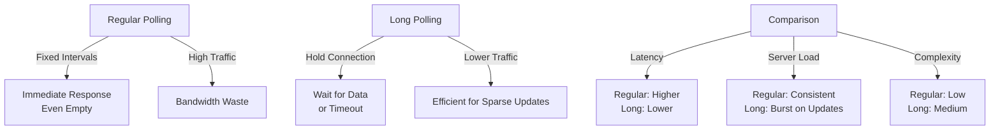

# Difference Between Long Polling and Regular Polling

Polling is a technique where a client repeatedly checks a server for updates. There are two main types: regular polling and long polling. They differ in efficiency, latency, and resource usage.

## Regular Polling (Short Polling)

- **How it Works**: Client sends requests at fixed intervals (e.g., every 5 seconds). Server responds immediately, even if no data is available (often with empty responses).
- **Pros**: Simple to implement; no server-side state.
- **Cons**: Inefficient for low-frequency updates—wastes bandwidth and CPU with empty responses. High latency for real-time needs.
- **Use Case**: When updates are frequent and immediate response isn't critical.
- **Example**: Client polls `/api/status` every 2 seconds, server always replies instantly.

## Long Polling

- **How it Works**: Client sends a request; server holds the connection open until data is available or a timeout occurs. Client then reconnects for the next poll.
- **Pros**: Reduces empty responses; lower latency for updates; more efficient for sparse events.
- **Cons**: Requires server to maintain open connections; can strain resources if many clients; more complex to implement.
- **Use Case**: Real-time apps like chat, notifications, or status checks where updates are infrequent.
- **Example**: Client polls `/api/updates`, server waits up to 30 seconds for data before responding.

## Key Differences

- **Connection Handling**: Regular closes immediately; Long keeps open longer.
- **Efficiency**: Long polling better for event-driven systems; regular for predictable intervals.
- **Fallback**: If long polling fails, fall back to regular.

In microservices (e.g., with SQS or Redis), long polling is used in APIs to wait for messages, reducing API calls.

