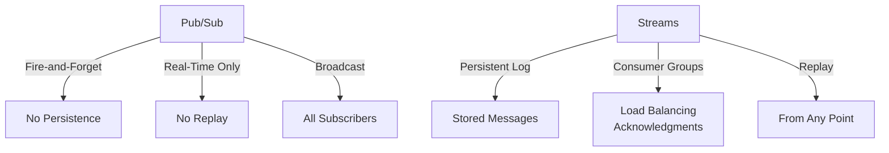

# Difference Between Redis Pub/Sub and Redis Streams

Redis Pub/Sub and Redis Streams are both messaging mechanisms in Redis, but they serve different purposes in data flow and persistence.

## Redis Pub/Sub Overview
- **Fire-and-Forget Model**: Publishers send messages to channels; subscribers receive them in real-time.
- **No Persistence**: Messages are not stored; if a subscriber is offline, they miss the message.
- **Use Case**: Real-time notifications, chat apps, or events that don't require history.

## Redis Streams Overview
- **Persistent Log**: Messages are appended to a stream and stored indefinitely (until trimmed).
- **Consumer Groups**: Support load balancing, acknowledgments, and replay from any point.
- **Use Case**: Event sourcing, audit logs, reliable messaging with history.

## Key Differences

- **Persistence**: Pub/Sub ephemeral; Streams durable.
- **Replayability**: Pub/Sub no; Streams yes.
- **Consumer Management**: Pub/Sub all get all; Streams groups for tracking.
- **Performance**: Pub/Sub faster for simple broadcasts; Streams adds overhead for persistence.
- **Scalability**: Streams better for high-throughput with persistence.

Choose Pub/Sub for transient events; Streams for reliable, historical data handling.