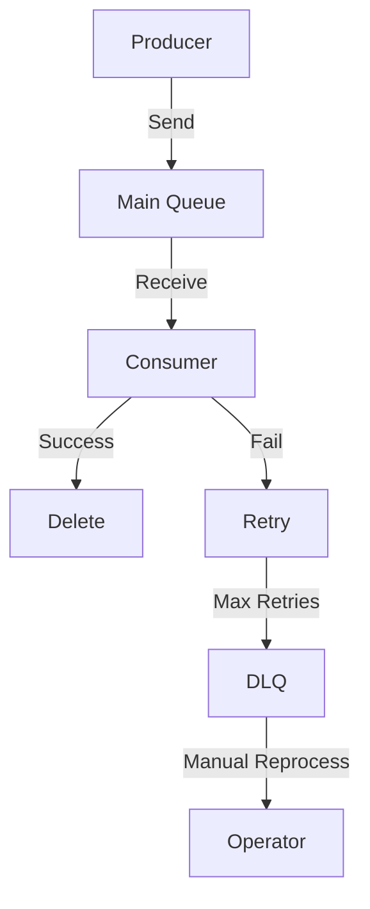

# How to Use and Implement SQS Dead-Letter Queue (DLQ)

SQS DLQ handles messages that fail processing after maximum retries, preventing them from blocking the main queue.

## Step-by-Step Implementation

### 1. Create Queues
- Create main queue (e.g., `my-queue`).
- Create DLQ (e.g., `my-dlq`) with same settings.

### 2. Configure Redrive Policy
Use AWS Console, CLI, or SDK to set redrive policy on main queue.

**AWS Console**:
- Go to SQS queue settings.
- Add redrive policy: Select DLQ, set MaxReceiveCount (e.g., 5).

**CLI Example**:
```bash
aws sqs set-queue-attributes --queue-url https://sqs.us-east-1.amazonaws.com/123456789012/my-queue --attributes '{"RedrivePolicy": "{\"deadLetterTargetArn\":\"arn:aws:sqs:us-east-1:123456789012:my-dlq\",\"maxReceiveCount\":\"5\"}"}'
```

**SDK Example (JavaScript)**:
```javascript
import { SQSClient, SetQueueAttributesCommand } from '@aws-sdk/client-sqs';

const sqs = new SQSClient({ region: 'us-east-1' });
await sqs.send(new SetQueueAttributesCommand({
  QueueUrl: 'https://sqs.us-east-1.amazonaws.com/123456789012/my-queue',
  Attributes: {
    RedrivePolicy: JSON.stringify({
      deadLetterTargetArn: 'arn:aws:sqs:us-east-1:123456789012:my-dlq',
      maxReceiveCount: '5'
    })
  }
}));
```

### 3. Producer Code (Send Messages)
No change; send as usual.

### 4. Consumer Code (Handle Messages with DLQ)
Process messages; delete on success. On failure, don't delete—let SQS retry up to MaxReceiveCount, then auto-move to DLQ.

**Example Consumer**:
```javascript
while (true) {
  const { Messages } = await sqs.send(new ReceiveMessageCommand({ QueueUrl: mainQueueUrl }));
  if (Messages) {
    try {
      // Process message (e.g., update DB)
      await processMessage(Messages[0]);
      // Success: Delete
      await sqs.send(new DeleteMessageCommand({
        QueueUrl: mainQueueUrl,
        ReceiptHandle: Messages[0].ReceiptHandle
      }));
    } catch (error) {
      console.error('Failed to process:', error);
      // Don't delete; SQS will retry
    }
  }
}
```

### 5. Monitor and Handle DLQ
- Use CloudWatch to monitor DLQ ApproximateNumberOfMessages.
- Manually inspect/reprocess messages from DLQ (e.g., via console or script).
- Re-send failed messages back to main queue if fixable.

## Diagram


## Best Practices
- Set MaxReceiveCount based on use case (3-10).
- Use visibility timeout to prevent duplicate processing.
- Test with low MaxReceiveCount initially.
- Automate DLQ reprocessing with Lambda.

For more, see [AWS SQS DLQ Docs](https://docs.aws.amazon.com/AWSSimpleQueueService/latest/SQSDeveloperGuide/sqs-dead-letter-queues.html).