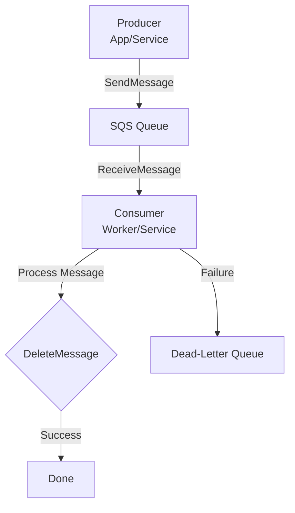

# AWS Simple Queue Service (SQS)

## Introduction

AWS Simple Queue Service (SQS) is a fully managed message queuing service provided by Amazon Web Services (AWS). It enables decoupling and scaling of microservices, distributed systems, and serverless applications by allowing components to communicate asynchronously through messages.

## How SQS Works

- **Producers**: Applications or services send messages to an SQS queue.
- **Queues**: Act as buffers to hold messages until they are processed.
- **Consumers**: Poll the queue to retrieve and process messages.
- Messages are deleted after successful processing to prevent re-processing.

## Key Features

- **Scalability**: Handles any volume of messages without pre-provisioning.
- **Reliability**: Messages are stored redundantly across multiple availability zones.
- **Visibility Timeout**: Temporarily hides messages from other consumers during processing.
- **Dead-Letter Queues**: Routes failed messages for further inspection.
- **Message Attributes and Metadata**: Allows tagging messages with custom data.
- **Encryption**: Supports server-side encryption for security.

## Queue Types

- **Standard Queues**: High-throughput, at-least-once delivery, best-effort ordering.
- **FIFO Queues**: Exactly-once processing, strict ordering, lower throughput.

## Use Cases

- **Microservices Communication**: Decouples services in a microservices architecture (e.g., one service processes user requests, another handles background jobs).
- **Event-Driven Architectures**: Triggers actions based on events without tight coupling.
- **Batch Processing**: Queues tasks for asynchronous execution.

## Comparison with Redis Pub/Sub and Streams

- **vs. Redis Pub/Sub**: SQS persists messages and ensures delivery even if consumers are offline; Pub/Sub is fire-and-forget and real-time only.
- **vs. Redis Streams**: SQS is cloud-managed and integrates with AWS ecosystem; Streams offer more advanced features like consumer groups but are Redis-specific.

## Getting Started

1. Create a queue in the AWS SQS console or via CLI/SDK.
2. Send messages using `SendMessage` API.
3. Poll messages using `ReceiveMessage` API.
4. Delete processed messages with `DeleteMessage`.

For more details, refer to the [AWS SQS documentation](https://docs.aws.amazon.com/sqs/).

## Architecture Diagram



## Advanced Explanations

- **Long Polling**: Reduces empty responses by waiting for messages up to a configurable time.
- **Batch Operations**: Send, receive, or delete multiple messages in one API call for efficiency.
- **Integration with Lambda**: Automatically triggers Lambda functions on new messages.
- **Monitoring**: Use CloudWatch metrics for queue depth, message throughput, and error rates.

## SQS Dead-Letter Queue (DLQ)
A DLQ is a separate SQS queue that stores messages that fail processing after a maximum number of receive attempts (MaxReceiveCount). This prevents poison messages from blocking the main queue and allows inspection/debugging.

### How DLQ Works:
1. Configure a redrive policy on the source queue, specifying the DLQ ARN and MaxReceiveCount (e.g., 5).
2. If a consumer fails to delete a message after MaxReceiveCount, SQS moves it to the DLQ.
3. Monitor DLQ for failed messages and reprocess manually.

### Benefits:
- Isolates failed messages.
- Prevents infinite retries.
- Enables debugging without affecting live processing.

### Example Configuration (AWS Console/CLI):
- Set redrive policy: `{"deadLetterTargetArn": "arn:aws:sqs:region:account:dlq-queue", "maxReceiveCount": 5}`

In the current architecture, use DLQ for workers failing on SQS tasks (e.g., S3 write errors) to ensure reliability.

This file will be expanded with more explanations, code examples, and comparisons as needed.

## SQS in the Current Microservices Architecture
SQS acts as the queuing layer for decoupling Next.js API from background workers, enabling async processing of hot/cold data flows.

### Integration Points
- **API Layer**: Next.js API sends messages to SQS for tasks like order processing or data archival.
- **Worker Layer**: Microservices poll SQS for jobs, process (e.g., update Redis hot data, save to cold S3), and delete messages.
- **Data Flow**: POST requests queue tasks; workers handle persistence without blocking API responses.

### Example Flow with Hot/Cold Data
1. Client POST → Next.js API sets hot status in Redis, sends task to SQS.
2. Worker polls SQS, processes (e.g., charges card, saves to DB), updates Redis for status.
3. Client polls status from Redis; worker archives to cold if needed.

### Benefits in Architecture
- **Scalability**: Workers scale independently via SQS.
- **Reliability**: Messages persist; dead-letter queues handle failures.
- **Cost**: Pay for messages processed, fits serverless Next.js.

### Code Example (API Sending to SQS)
```typescript
import { SQSClient, SendMessageCommand } from '@aws-sdk/client-sqs';
const sqs = new SQSClient({ region: 'us-east-1' });

await sqs.send(new SendMessageCommand({
  QueueUrl: process.env.SQS_QUEUE_URL,
  MessageBody: JSON.stringify({ action: 'processOrder', data })
}));
```

### Code Example (Worker Consuming SQS)
```typescript
const { Messages } = await sqs.send(new ReceiveMessageCommand({ QueueUrl }));
if (Messages) {
  const task = JSON.parse(Messages[0].Body);
  // Process task
  await sqs.send(new DeleteMessageCommand({ QueueUrl, ReceiptHandle }));
}
```

SQS ensures async, reliable task distribution in the architecture, complementing Redis for hot data and S3 for cold.

